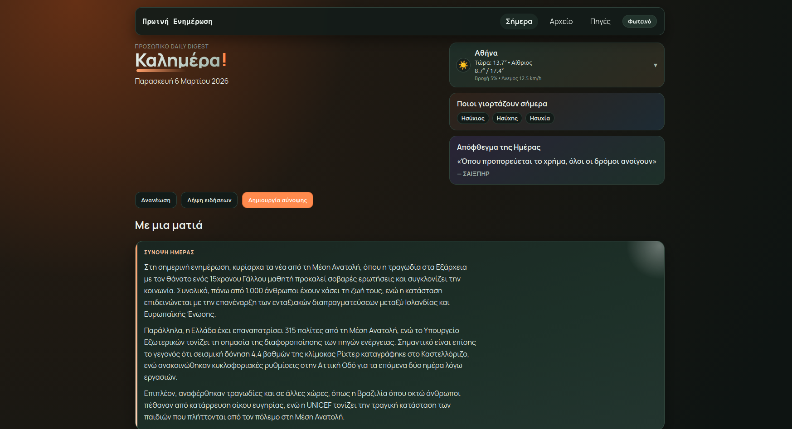
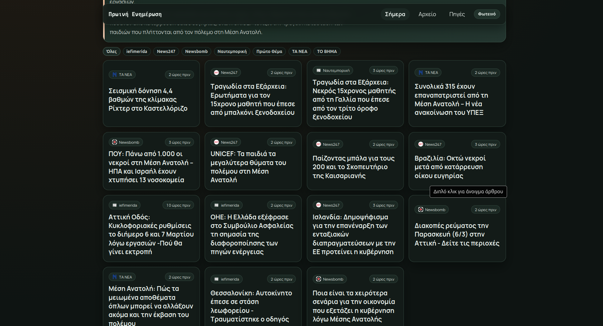
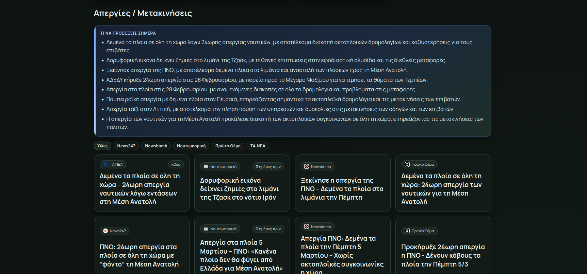

# Πρωινό Briefing

Greek morning briefing application for daily news monitoring and summarization.

## What The App Does

Every day the app builds a briefing with:
- Top stories clustered from multiple Greek news sources
- Strike and transport updates
- Weather snapshot + 3-day outlook
- Name day information
- Quote of the day

The stack:
- Backend API: FastAPI (`/api`)
- Frontend: React + Vite
- Database: SQLite (`backend/data.db`)
- Scheduler: APScheduler (daily ingestion + briefing generation)

## Screenshots

### Today Overview



### News Grid



### Strikes / Transport



## Pipeline Overview

1. Fetch articles from enabled sources (RSS + sitemap/JSON feeds).
2. Normalize and deduplicate articles by canonical URL/fingerprint.
3. Build daily clusters using title similarity and token overlap.
4. Rank clusters by coverage, freshness, impact signals, and source weight.
5. Generate daily summaries (top stories + strikes) through the configured LLM provider.
6. Enrich with weather, name days, and quote of the day.
7. Persist final briefing payload for Today and Archive views.

## Quick Start

Backend:

```bash
cd backend
python3 -m venv .venv
source .venv/bin/activate
pip install -r requirements.txt
cp .env.example .env
uvicorn app.main:app --reload --port 8000
```

Frontend:

```bash
cd frontend
npm install
npm run dev
```

Default frontend API config:
- `VITE_API_BASE=/api`
- `VITE_BACKEND_URL=http://localhost:8000`

Local URLs:
- Frontend: `http://localhost:5173`
- Backend API: `http://localhost:8000`
- Swagger UI: `http://localhost:8000/docs`

## First Run Checklist

1. Start backend and verify `GET /health` returns `{"ok": true}`.
2. Start frontend and open the Today page.
3. Trigger ingestion manually (optional but useful on a fresh DB):

```bash
curl -X POST http://localhost:8000/api/admin/run-ingestion
```

4. Force briefing generation for a specific day:

```bash
curl -X POST http://localhost:8000/api/admin/generate-briefing \
  -H 'Content-Type: application/json' \
  -d '{"day":"2026-03-05"}'
```

## Scheduling

On app startup the backend:
- Initializes DB tables
- Seeds default sources
- Starts a daily scheduler job

Default schedule is `08:30` in `Europe/Athens` timezone, controlled by:
- `SCHEDULE_HOUR`
- `SCHEDULE_MINUTE`
- `TIMEZONE`

## LLM + Fallback Behavior

- Supported providers: `openai`, `anthropic`, `ollama`, `gemini`, `groq`, `custom`
- If summary generation fails, the briefing still returns structural data (stories, strikes, weather, etc.), while summary fields may be empty.
- Strike feed can optionally use LLM curation via `STRIKE_FEED_USE_LLM=true`.

## Docs (MkDocs Material)

Run docs locally:

```bash
pip install -r requirements-docs.txt
mkdocs serve -a 127.0.0.1:8001
```

Open `http://127.0.0.1:8001`.

Build static docs:

```bash
mkdocs build
```

## Project Structure

- `backend/` FastAPI app, ingestion, clustering/ranking, summarization, scheduler
- `frontend/` React UI (`Today`, `Archive`, `Settings`)
- `docs/` MkDocs pages (setup, config, API, architecture)
- `mkdocs.yml` docs site config
