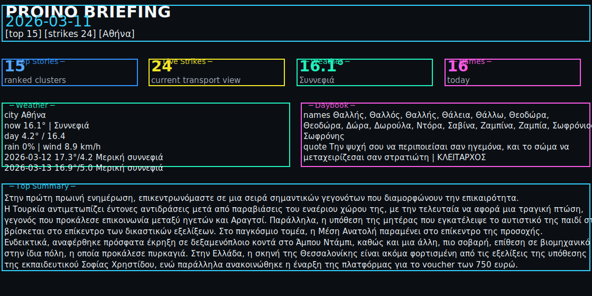
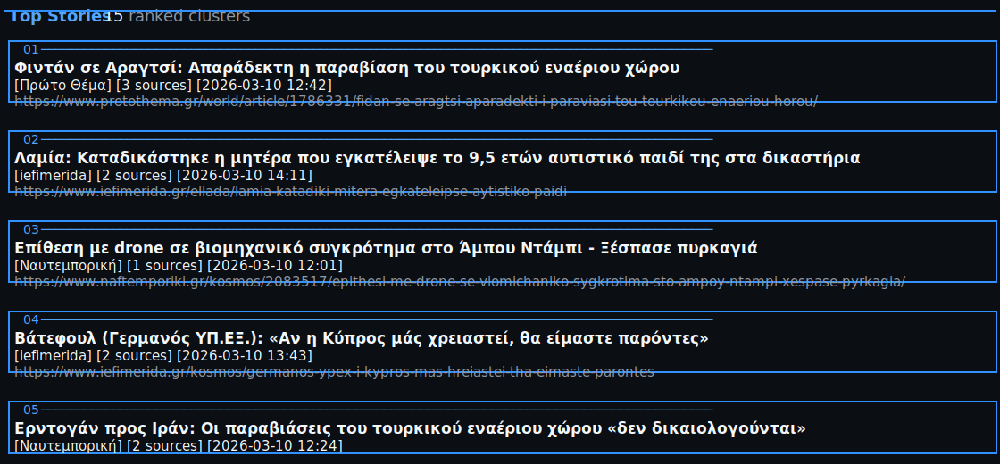

# Proino Briefing

Proino Briefing is a local-first Greek news digest app that aggregates daily news, clusters related stories, ranks the most important topics, and generates concise summaries for morning review.

## Core Features

- Daily top-story briefing from multiple Greek news sources
- Strike and transport update feed for current-day monitoring
- Weather panel with current conditions and short forecast
- Name day extraction and quote-of-day extraction
- Optional scheduled or manual HTML email delivery
- Source controls (enable/disable + per-source weighting)
- Archive browsing for past generated briefings

## UI Preview

### Today Overview

### News Grid

### Strikes / Transport

## CLI Preview

### CLI Dashboard

Example output from `backend/.venv/bin/python backend/brief.py today`

### CLI Top Stories

Example output from the story section of `backend/.venv/bin/python backend/brief.py today`

## System Components

- `backend/`: FastAPI API, ingestion services, dedupe, ranking, summarization, scheduler
- `frontend/`: React UI with pages for Today, Archive, and source settings
- `backend/data.db`: SQLite persistence for sources, articles, clusters, summaries, and briefings

## Local URLs

- Backend API: `http://localhost:8000`
- Swagger UI: `http://localhost:8000/docs`
- Frontend (Vite): `http://localhost:5173`

## Documentation Map

- **Getting Started**: local setup, first run, validation steps
- **Configuration**: environment variables and operational tuning
- **API**: routes, parameters, and response behaviors
- **Architecture**: end-to-end pipeline and data model
